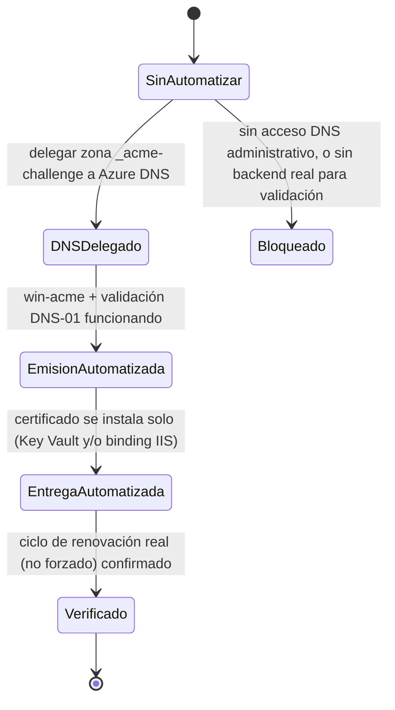

# Mapa de estados — Automatización de renovación SSL

Estado del proceso de automatización en sí (no de tickets Jira) para cada servicio público de SmartFran/Grido.

## Estado actual por servicio (2026-08-07)

| Servicio | Hostname | Estado | Detalle |
|---|---|---|---|
| MobileAppService | `mobileservice.clubgrido.com.ar` | **EntregaAutomatizada** | DNS-01 + emisión + instalación verificadas en ambas VMs; falta confirmar un ciclo real no forzado |
| ClubSite AR — tramo público | `www.clubgrido.com.ar` (listener WAF) | **EntregaAutomatizada** | Certificado vía Key Vault, corte verificado sin downtime; falta confirmar ciclo real (recordatorio 2026-10-03) |
| ClubSite AR — tramo backend | `www.clubgrido.com.ar` (IIS, ambos nodos) | **EntregaAutomatizada** | Automatizado independientemente en `SFCG-CLUB-01` y `SFCG-CLUB-02`; falta confirmar ciclo real (mismo recordatorio) |
| ClubSite PY | `www.clubgrido.com.py` | **Bloqueado** | Sin acceso DNS administrativo al dominio `.com.py`; HTTP-01 tampoco viable (redirección sin backend real) |
| WebSite | `gestion.clubgrido.com.ar` | **SinAutomatizar** | No iniciado |
| WebServiceV2 | — | **SinAutomatizar** | No iniciado |
| WebServiceCG | — | **SinAutomatizar** | No iniciado |

**Última actualización:** 2026-08-07. Seguimiento de tickets (no el objeto de este diagrama): [GITIN-1768](https://smartit-ar.atlassian.net/browse/GITIN-1768) (épica) y sus seis subtareas.
