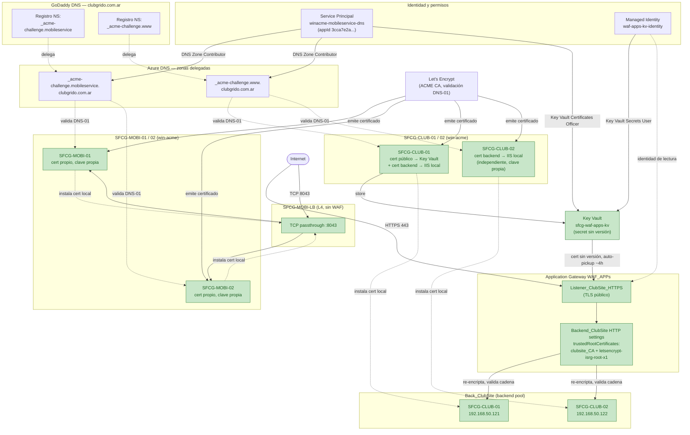

# Mapa de infraestructura — Automatización SSL (GITIN-1768)

Topología técnica real de los dos tramos ya implementados (`GITIN-1774` MobileAppService, `GITIN-1770` ClubSite AR) — complementa a `epic_map.md` (que muestra estado por ticket, no la infraestructura).

**Notas:**
- `SFCG-MOBI-01`/`02` no pasan por re-encriptación de gateway (LB de capa 4) — cada VM sirve su propio certificado directo al cliente.
- `SFCG-CLUB-01`/`02` sí tienen dos TLS independientes: público (Cliente↔Gateway, vía Key Vault) y backend (Gateway↔Backend, cert local en cada VM) — ver hallazgo crítico en `operations/events/20260806_automatizar_clubsite_ar/investigation.md`.
- `letsencrypt-isrg-root-x1` es el único certificado de cadena cargado en el gateway — los intermedios (`YR1`/`YR2`) los sirve cada VM backend directamente, no van en `trustedRootCertificates`.

**Última actualización:** 2026-08-07.
