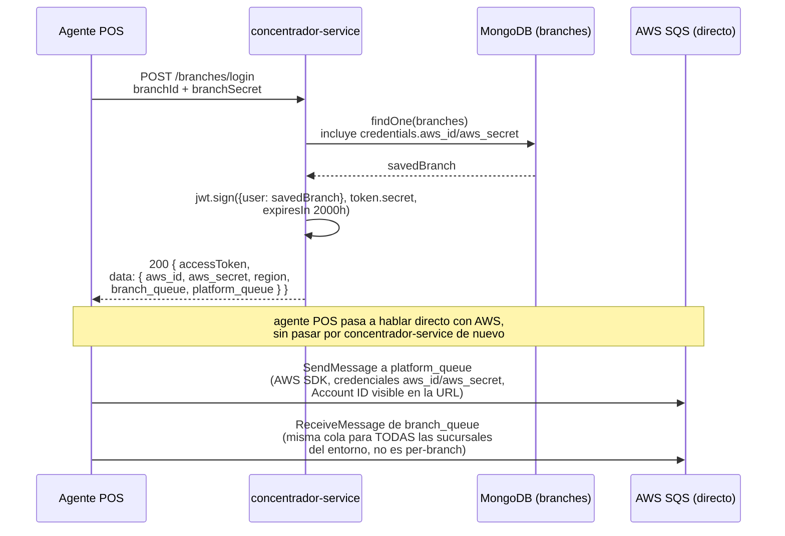
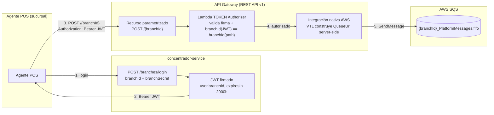

# [SP] Ocultar Account ID de AWS en URLs de SQS expuestas a agentes POS

**Tipo:** Mejora de seguridad / Análisis de arquitectura
**Componente:** concentrador-service (origen de las URLs) / SmartFran Agente (POS, consumidor)
**Prioridad:** Alta
**Etiquetas:** SmartPedidos, Concentrador, Platform, AWS, SEGURIDAD, SRE
**Referencia:** ticket relacionado [10-07-2026_credenciales-expuestas-logs](../10-07-2026_credenciales-expuestas-logs/10-07-2026_credenciales-expuestas-logs.md) (SEC-006)

---

## Alcance de esta mejora — no reemplaza SEC-002/003/006

Ocultar el Account ID reduce el valor de reconocimiento de una URL interceptada (enumeración de ARNs, confused deputy, pretexto de phishing), pero **no es una mitigación de la vulnerabilidad de fondo**: la credencial estática `userSQS` con `AmazonSQSFullAccess` (`Resource: *`) embebida en cada JWT de sucursal sigue permitiendo lectura/escritura/purga de cualquier cola de la cuenta, en cualquier región, independientemente de si la URL expone o no el Account ID. Esta mejora es complementaria — el valor real de esta propuesta es que, al mover la interacción con SQS detrás de API Gateway, dejan de ser necesarias credenciales AWS en el agente POS (el POS se autentica con el JWT de sucursal que ya tiene), lo cual sí resuelve SEC-006. La rotación/scoping de la credencial actual (SEC-002/SEC-003) sigue siendo prioridad independiente de este ticket.

## Origen del JWT del agente POS (verificado en código fuente)

Se verificó contra `concentrador-service/api/src/controllers/branch.js:4562` (`login`, ruteado en `POST /branches/login`, `routes/branches.js:82`) quién emite el JWT que hoy porta las credenciales AWS hacia el agente POS:

- El JWT lo emite **concentrador-service**, no ninguna plataforma de delivery (PedidosYa, Uber Eats, Rappi). El agente SmartFran POS se autentica con `branchId`/`branchSecret` propios contra la colección `branches` de Mongo — no hay participación de terceros en este flujo.
- Firma: `jwt.sign({ user: savedBranch }, settings.token.secret, { expiresIn: '2000h' })` (`branch.js:4665-4672`) — secret y firma enteramente internos, vigencia ~83 días.
- Las llamadas `peyaLogin`/`uberLogin`/`rappiLogin` visibles en el mismo handler (`branch.js:4580-4587`) son un bootstrap de cron no relacionado: ahí concentrador-service obtiene *sus propios* tokens para llamar a la API de cada plataforma. No participan en la emisión del JWT de sucursal — coincidencia de ubicación en el código, no de flujo.
- **Hallazgo nuevo:** las credenciales AWS no sólo viajan dentro del JWT firmado (vía el claim `user` = `savedBranch`, que incluye `credentials.aws_id/aws_secret`) — se duplican además en el **body de la respuesta HTTP sin firmar**, en el objeto `data` (`branch.js:4674-4681`, campos `aws_id`/`aws_secret` explícitos junto a `accessToken`). Es un segundo vector de exposición no documentado en el ticket de origen: cualquier captura de la respuesta de `/branches/login` (no sólo la decodificación del JWT) expone la credencial en texto plano.

**Relevancia para este ticket:** confirma que toda la cadena de emisión de credenciales (auth de sucursal → firma de JWT → adjunto de credenciales AWS) es enteramente interna a `concentrador-service`. La migración a este proxy de API Gateway (y la eliminación de credenciales AWS del agente, SEC-006) no requiere coordinación con ninguna plataforma de delivery — sólo cambios en `branch.js` y en el agente SmartFran.

## Descripción del problema

Las URLs de las colas SQS que se distribuyen a los agentes de sucursal/POS exponen el Account ID de AWS de producción en texto plano, por ejemplo:

```
https://sqs.us-east-2.amazonaws.com/382381053403/18STG_PlatformMessages.fifo
```

Sumado a que hoy además se embebe `AWS_ID`/`AWS_SECRET` en el JWT de cada agente (ver SEC-006 del ticket referenciado), esto amplía la superficie de reconocimiento disponible ante una intercepción o extracción de la URL: el Account ID es un dato reusable para enumeración de recursos (ARNs), ataques de confused deputy, y correlación entre servicios que comparten la misma cuenta AWS.

Se solicita evaluar mecanismos nativos de AWS para exponer cada cola bajo un dominio propio (p. ej. `https://colas.smartpedidos.com/<nombre-cola>`), sin Account ID visible en ningún punto de la URL, con una URL estable por cola.

## Propuesta técnica (para análisis)

### Opción recomendada — Amazon API Gateway con integración de servicio nativa a SQS

- API Gateway (HTTP API o REST API) soporta integración directa con la API de SQS (`SendMessage`, `ReceiveMessage`, `DeleteMessage`) sin necesidad de una Lambda intermedia, mapeando cada acción vía plantilla VTL (REST API) o integración directa con IAM (HTTP API).
- El Account ID y el nombre real del recurso SQS quedan configurados en la integration request, del lado del servidor — nunca son visibles para el cliente (POS).
- El *custom domain name* de API Gateway permite mapear `colas.smartpedidos.com` con un *base path* por cola, dando una URL estable y propia por cola sin Account ID en ningún punto de la ruta: `https://colas.smartpedidos.com/18STG_PlatformMessages.fifo`.
- **Corrección de diseño (2026-07-20):** dado que las colas siguen la convención `{branchId}_PlatformMessages.fifo` (una por sucursal), "una URL por cola" no debe implementarse como un recurso literal fijo por cola en API Gateway — eso requeriría redeploy del API por cada sucursal nueva. El diseño correcto es **un único recurso parametrizado** (`/{branchId}`) cuya plantilla de mapeo construye el `QueueUrl` real del lado del servidor a partir del path parameter, cubriendo todas las sucursales actuales y futuras sin cambios en la API.
- La integración nativa a servicios AWS (`AWS`, no `AWS_PROXY`, con plantillas VTL) sólo está disponible en **REST API (API Gateway v1)** — las **HTTP API (v2)** no soportan integración directa a SQS sin Lambda intermedio. Esto afecta directamente el costo (ver sección "Estimación de costo").
- Resuelve, como efecto colateral directo, el punto pendiente **SEC-006 (Opción B)** del ticket 10-07-2026: si el POS habla con API Gateway en vez de directo con SQS, la credencial AWS estática (`userSQS`, `AmazonSQSFullAccess`) deja de ser necesaria en el agente. API Gateway puede autenticar al POS con API key o autorizador propio (reutilizando el JWT de sucursal ya existente), sin que el agente maneje credencial AWS alguna.

### Autenticación del POS contra el proxy — decisión ARQ-002, con caveat de binding obligatorio

**Decisión:** reutilizar el JWT de sucursal ya emitido por `POST /branches/login` como credencial de autenticación contra el nuevo proxy, en vez de emitir un mecanismo nuevo. Dado que REST API (v1) no soporta un autorizador JWT nativo para tokens firmados con secreto simétrico (HS256) — esa integración nativa sólo existe para JWKS/RS256 en HTTP API (v2), que no soporta la integración nativa a SQS (ver sección anterior) — la validación requiere un **Lambda TOKEN authorizer** que verifique la firma con el mismo secreto que usa concentrador-service. Este Lambda es distinto del descartado en la Opción A' (que estaba en el *data path* de cada mensaje): el authorizer sólo corre en la decisión de autorización y su resultado se cachea (TTL por defecto 300s), por lo que no reabre el trade-off de costo de "sin Lambda".

**Caveat 1 — sin mecanismo de revocación:** el JWT es stateless; concentrador-service no puede invalidarlo antes de su vencimiento. Un token filtrado sigue siendo válido contra el nuevo proxy durante toda su vigencia (`expiresIn: '2000h'`, ~83 días — ver `branch.js:4665-4672`), igual que hoy contra SQS directo. Migrar a este proxy no acorta esa ventana de exposición.

**Caveat 2 — binding de `branchId` obligatorio, no opcional:** el `{branchId}` de la ruta es un valor controlado por el llamante, no necesariamente el de la sucursal dueña del token. El Lambda authorizer **debe** comparar el claim `user.branchId` del JWT contra el path parameter `{branchId}` de la request y rechazar si no coinciden. Sin este chequeo, un JWT filtrado de la sucursal A podría usarse para enviar mensajes a la cola de la sucursal B simplemente cambiando la URL — un vector nuevo que no existe hoy contra SQS directo de la misma forma (hoy la credencial AWS estática embebida ya es de alcance cuenta completa, así que el radio de impacto de este proxy sigue siendo menor incluso sin el binding, pero el binding es requisito de diseño, no hardening opcional).

**Pendiente relacionado:** el secreto (`settings.token.secret`) que el Lambda authorizer necesita para verificar la firma no debe duplicarse como literal en el Lambda — debe obtenerse de Secrets Manager/SSM, para no crear una segunda copia del secreto compartido fuera de concentrador-service.

### Diagrama de flujo actual (as-is, verificado contra código fuente)



**Puntos débiles visibles en este flujo, confirmados contra código:**
- `aws_id`/`aws_secret` son el **mismo par estático para todas las sucursales** (`saveOne`, `branch.js` ~4419) — sin aislamiento real por sucursal pese a guardarse por-sucursal en el schema.
- El Account ID de AWS queda expuesto en cualquier `QueueUrl` que el agente construya o loguee (el problema central de este ticket).
- `branch_queue` (`ORDER_CONSUMER.NAME`) es una **cola compartida por entorno**, no por sucursal — cualquier agente con las credenciales puede leer/purgar mensajes de cualquier otra sucursal.
- Sin mecanismo de revocación de credenciales — rotar `aws_id`/`aws_secret` requiere tocar cada sucursal en Mongo, no hay proceso de rotación hoy (ver `20260720_credenciales-mongodb-hardcodeadas`).

### Diagrama de flujo propuesto



Lo que el agente POS nunca ve: el Account ID de la cuenta, el nombre real de la cola, ni ninguna credencial AWS (`aws_id`/`aws_secret`) — todo queda resuelto del lado del servidor, en el paso 4→5.

### Aclaración sobre el requisito "no debe ser un CNAME"

Ningún dominio custom de AWS (API Gateway custom domain, o CloudFront delante de éste) inserta el Account ID en el registro DNS ni en el hostname resuelto (`*.execute-api.<region>.amazonaws.com` / `*.cloudfront.net`). Una resolución `dig`/`nslookup`/inversa sobre `colas.smartpedidos.com` revela, como máximo, que el origen es API Gateway o CloudFront — nunca el Account ID de la cuenta.

Por lo tanto, el tipo de registro DNS (CNAME vs. Route 53 ALIAS) no es lo que determina si el Account ID queda expuesto; lo que lo oculta es que el origen deje de ser `sqs.<region>.amazonaws.com/<account-id>/...` y pase a ser API Gateway. Route 53 ALIAS es la opción más prolija si se quiere evitar un CNAME propiamente dicho en el apex/subdominio, pero no es un requisito de seguridad para este objetivo — no debe tratarse como bloqueante del diseño.

### Alternativas descartadas para este caso

- **VPC endpoint / PrivateLink para SQS:** oculta el tráfico dentro de una VPC, pero no aplica — los POS de sucursal acceden por Internet público, no desde dentro de la VPC de AWS.
- **Lambda Function URL como proxy:** requiere una Lambda adicional por acción/cola y el mismo trabajo de dominio custom que API Gateway, sin las integraciones nativas de mapeo a SQS — mayor complejidad sin beneficio adicional sobre la opción recomendada.

### Comparación — solo API Gateway vs. CloudFront + API Gateway

| Aspecto | Solo API Gateway (custom domain regional) | CloudFront + API Gateway |
|---|---|---|
| Latencia | Menor — un solo hop, sin capa de edge adicional | Hop adicional; el beneficio de edge (POP cercano) no aplica si los POS están concentrados en pocas regiones/AR |
| Caching | No aporta — respuestas de SQS no son cacheables (writes/reads transaccionales) | Mismo caso — sin beneficio real, TTL efectivo 0 en el comportamiento |
| WAF / protección perimetral | AWS WAF soportado directamente sobre API Gateway regional | Patrón más maduro/común para WAF + Shield en el edge; útil si se buscan reglas geográficas o de rate-limit más agresivas |
| Complejidad operativa | Menor — un solo servicio a configurar, desplegar y monitorear | Mayor — dos servicios, dos configuraciones de dominio/certificado, más puntos de falla que diagnosticar ante un incidente |
| Certificado TLS (ACM) | Puede vivir en la misma región que el API Gateway (`us-east-2`) | Debe emitirse en `us-east-1` obligatoriamente (requisito de CloudFront), independiente de la región del backend |
| Logging / Observabilidad | Logs de acceso + CloudWatch de API Gateway únicamente | Logs de acceso de CloudFront + CloudWatch de API Gateway — más fuentes que correlacionar ante un problema |
| Costo | Sólo tarifa de requests de API Gateway REST + data transfer out estándar — **~$517,16/mes** al volumen actual, sin Lambda (ver Estimación de costo, corregida 2026-07-20) | Tarifa de requests de API Gateway **más** tarifa de requests y data transfer de CloudFront — **~$664,92/mes**, +$147,76/mes sobre Opción A al mismo volumen, sin beneficio de cacheo |
| Aislamiento de otros dominios | Dominio y despliegue dedicados, sin relación con otra infraestructura de la cuenta | Podría, en teoría, compartir una distribución con otros dominios — pero ya se descartó reutilizar `EN17DHYYWUZ8X` por estar acoplada a un frontend no relacionado |

**Lectura preliminar:** para este caso (tráfico transaccional, no cacheable, sin necesidad reportada de reglas de edge/WAF más allá de lo que ya ofrece API Gateway regional) la opción "solo API Gateway" es la de menor costo y menor complejidad operativa. CloudFront se justificaría únicamente si en ARQ-001 surge un requisito concreto de WAF a nivel edge o de protección DDoS ampliada (Shield Advanced sobre recurso CloudFront) que no cubra el WAF regional de API Gateway — a validar, no asumir.

### Reutilización de infraestructura existente — descartada

Se relevó la distribución CloudFront existente `EN17DHYYWUZ8X` (`ETag E1MQS2ZIL8VD22`) como candidata a reutilizar. Se descarta:

- Alias configurado: `boprodpedidos.smartfran.com` — sirve el frontend estático de back-office.
- Origen único: S3 (`boprodpedidos.smartfran.com.s3.amazonaws.com`), sin origin groups.
- `DefaultCacheBehavior` sólo permite `GET`/`HEAD` — no soporta el `POST` que requiere una integración a SQS (`SendMessage`) sin agregar un segundo origen y comportamiento a una distribución que hoy sirve un frontend no relacionado.

**Recomendación:** no extender `EN17DHYYWUZ8X`. Dado que las respuestas de SQS no son cacheables, CloudFront no aporta valor por sobre lo que ya da el *custom domain* nativo de API Gateway (endpoint tipo *regional*, certificado ACM propio, registro Route 53 propio) — se recomienda evitar el salto adicional por CloudFront y publicar `colas.smartpedidos.com` directamente sobre API Gateway, salvo que se identifique una necesidad concreta de WAF/edge en el análisis (ARQ-001).

## Estimación de costo

**Volumen base (real):** 147.761.190 requests SQS FIFO en junio 2026 (`aws ce get-cost-and-usage`, `USAGE_TYPE=Requests-FIFO-RBP`), con costo real de **$73,38** (requests) + **$0,11** (data transfer out, 1,43 GB) = **$73,49/mes**. Se usa como volumen de referencia para proyectar ambas arquitecturas — asume que el proxy mantiene 1 request de origen por cada llamada SQS actual (sin cambios de *batching*).

**Corrección (2026-07-20):** la integración nativa a SQS sin Lambda sólo existe en **REST API (API Gateway v1)**, no en HTTP API (v2). El cálculo original de esta sección usaba por error la tarifa de HTTP API ($1,00/millón); se corrige abajo con la tarifa real de REST API ($3,50/millón, primer tramo) y se agrega una tercera opción (HTTP API + Lambda liviana) como alternativa más económica que sí es válida técnicamente.

**Tarifas vigentes (AWS Pricing API, on-demand, sin descuentos EDP/reservados):**

| Producto | SKU / Rate Code | Tarifa | Fuente |
|---|---|---|---|
| API Gateway **REST API** — `us-east-2` (Ohio), tramo 0–333M/mes | `6GJWQNG8KBVT7A5U` | $3,50 / millón de requests | `AmazonApiGateway`, `usagetype=USE2-ApiGatewayRequest` |
| API Gateway HTTP API — `us-east-2` (Ohio), tramo 0–300M/mes (sólo válido si el backend es Lambda, no SQS nativo) | `9R977R3Z4DEQKWJB` | $1,00 / millón de requests | `AmazonApiGateway`, `usagetype=USE2-ApiGatewayHttpRequest` |
| CloudFront — Proxy HTTPS (POST/PUT/PATCH/DELETE/OPTIONS, US) | `DCX5PSWXNPZDK63Q` | $0,0100 por 10.000 requests ($1,00/millón) | `AmazonCloudFront`, `usagetype=US-Requests-HTTPS-Proxy` |

Se usó la tarifa *Proxy HTTPS* de CloudFront (no la de GET/HEAD, más barata a $0,0075/10.000) porque las llamadas a SQS (`SendMessage`/`ReceiveMessage`/`DeleteMessage`) se emiten como `POST` — CloudFront las trata como tráfico no cacheable reenviado al origen.

| Escenario | Cálculo | Costo mensual estimado |
|---|---|---|
| Actual — SQS directo (baseline) | Facturación real AWS, junio 2026 | **$73,49** (real) |
| **Opción A — Solo API Gateway REST, integración nativa** (`us-east-2`, custom domain regional, sin Lambda) | 147.761.190 req × $3,50/millón | **~$517,16** |
| **Opción A' — HTTP API + Lambda liviana** (proxy de una función mínima a SQS) | (147.761.190 × $1,00/millón API Gateway) + Lambda (~147,76M invocaciones × $0,20/millón + cómputo mínimo) ≈ $147,76 + ~$32,63 | **~$180,39** |
| **Opción B — CloudFront + API Gateway REST nativo** | (147.761.190 × $3,50/millón API Gateway) + (147.761.190 × $1,00/millón CloudFront proxy HTTPS) | **~$664,92** + data transfer CloudFront (no cuantificado, ver nota) |

**Deltas (vs. baseline $73,49/mes):**
- Opción A (REST nativo, sin Lambda): **+$443,67/mes (+604%)**
- Opción A' (HTTP API + Lambda): **+$106,90/mes (+145%)** — la más económica de las tres, a costa de sumar Lambda como componente operativo adicional.
- Opción B (CloudFront + REST nativo): **+$591,43/mes (+805%)**; +$147,76/mes sobre Opción A por el segundo salto de requests en CloudFront, sin beneficio de cacheo.

**Nota de alcance:** no se cuantificó el data transfer propio de CloudFront (edge→origen / edge→viewer) — la familia de producto `Data Transfer` de CloudFront no se filtra por `location` sino por `fromLocation`/`toLocation`; con ~1,4 GB/mes de transferencia el impacto es marginal frente a las diferencias de requests y no cambia la conclusión.

**Conclusión revisada:** ninguna variante evaluada es más barata que el acceso directo a SQS — el objetivo de este ticket es seguridad (ocultar Account ID, eliminar credenciales AWS del agente POS), no ahorro de costo. Entre las opciones viables, **Opción A' (HTTP API + Lambda liviana)** es la de menor costo incremental (+145% vs. +604% de REST nativo) pero suma un componente (Lambda) al diseño "sin Lambda" originalmente buscado; **Opción A (REST nativo)** es la más simple operativamente si el presupuesto lo permite. CloudFront (Opción B) se descarta en cualquier combinación — no aporta valor y encarece cualquiera de las dos bases en +$147,76/mes.

## Criterios de aceptación

- [ ] Se evaluó formalmente la propuesta de API Gateway + custom domain como reemplazo del acceso directo POS→SQS.
- [ ] Se definió si esta solución reemplaza o complementa la Opción B de SEC-006 (ticket 10-07-2026_credenciales-expuestas-logs).
- [ ] Se validó que el diseño elegido no expone el Account ID de AWS en ningún punto de la URL ni de la resolución DNS.
- [ ] Se estimó el esfuerzo de migración para los agentes de sucursal existentes (cambio de endpoint + esquema de autenticación).
- [ ] Se definió el mecanismo de autenticación del POS contra el nuevo endpoint (API key / autorizador custom / JWT existente) en reemplazo de la credencial AWS estática.

## Sub-tareas

| ID | Descripción | Estado |
|---|---|---|
| ARQ-001 | Documentar y validar diseño de API Gateway con integración nativa a SQS (recurso parametrizado `/{branchId}`, custom domain `colas.smartpedidos.com`) | ⚠️ Pendiente |
| ARQ-002 | Definir mecanismo de autenticación del agente POS contra API Gateway (reemplazo de `AWS_ID`/`AWS_SECRET` embebidos) | ✅ [2026-07-28](20260720_ocultar-account-id-sqs-urls_events.md#2026-07-28-3) — Lambda TOKEN authorizer validado end-to-end en el PoC (firma + binding de `branchId` obligatorio, 5 escenarios probados) |
| ARQ-003 | Estimar esfuerzo de migración en `SmartFran Agente` (cambio de endpoint SQS directo → API Gateway) | 🔄 Superficie de integración en concentrador-service mapeada [2026-07-28](20260720_ocultar-account-id-sqs-urls_events.md#2026-07-28-2) — falta el lado del agente POS (repo fuera de este monorepo) |
| ARQ-004 | Decidir estrategia de DNS (Route 53 ALIAS vs. CNAME) para `colas.smartpedidos.com` | ⚠️ Pendiente |
| ARQ-005 | Confirmar con el equipo dueño del diseño de auth de concentrador-service si esta propuesta reemplaza la Opción B de SEC-006 o corre en paralelo | ⚠️ Pendiente |
| ARQ-006 | Aprovisionar *custom domain* dedicado de API Gateway (no reutilizar `EN17DHYYWUZ8X`, que sirve `boprodpedidos.smartfran.com`) | ⚠️ Pendiente |
| ARQ-007 | Estimar costo mensual (API Gateway solo vs. CloudFront + API Gateway) en base al volumen real de requests SQS actual, vía AWS Cost Explorer + Pricing API | ✅ [2026-07-20](20260720_ocultar-account-id-sqs-urls_events.md#2026-07-20-3), corregido [2026-07-20](20260720_ocultar-account-id-sqs-urls_events.md#2026-07-20-4) |
| ARQ-008 | Decidir entre Opción A (REST API nativo, sin Lambda, ~$517/mes) y Opción A' (HTTP API + Lambda liviana, ~$180/mes) en base a presupuesto vs. tolerancia a un componente Lambda adicional | ⚠️ Pendiente |
| ARQ-009 | PoC de validación: recurso parametrizado `/{branchId}` en REST API contra una cola SQS de prueba desechable, cuenta `382381053403`, región `us-west-2` | ✅ [2026-07-28](20260720_ocultar-account-id-sqs-urls_events.md#2026-07-28) — mecanismo validado end-to-end |
| ARQ-010 | Nuevo análisis de costos (Lambda authorizer + Secrets Manager + CloudWatch Logs, no contemplados en ARQ-007) | 🔀 Movido a ticket propio: [20260728_nuevo-analisis-costos](../20260728_nuevo-analisis-costos/20260728_nuevo-analisis-costos.md) |
