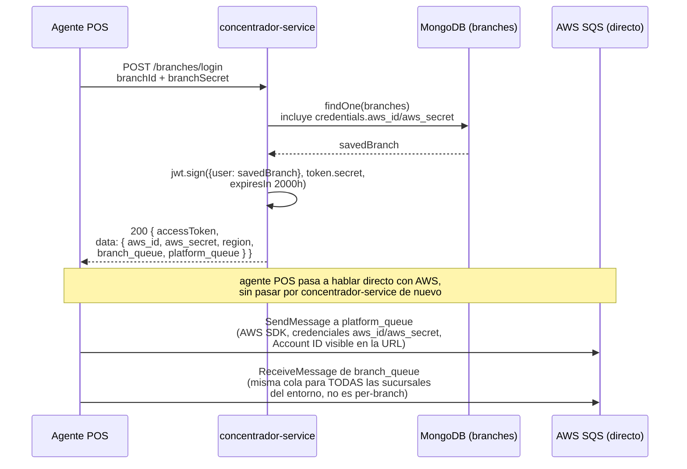
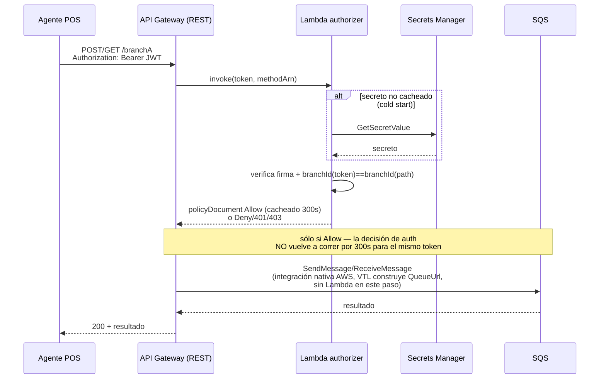
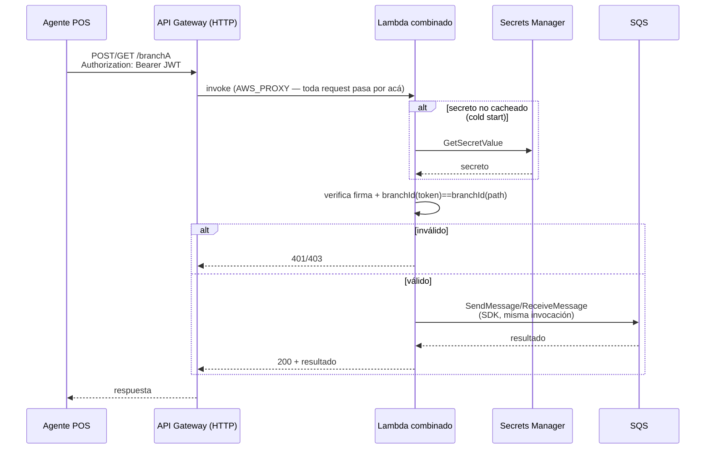

# [SP] Nuevo análisis de costos — proxy API Gateway completo (SQS + authorizer + vault)

**Tipo:** Análisis de costos
**Componente:** AWS (API Gateway, SQS, Lambda, Secrets Manager) — logging vía Event Hub → Graylog, no CloudWatch Logs
**Prioridad:** Media
**Etiquetas:** SmartPedidos, AWS, Costos, SRE
**Referencia:** ticket de origen [20260720_ocultar-account-id-sqs-urls](../20260720_ocultar-account-id-sqs-urls/20260720_ocultar-account-id-sqs-urls.md) (era ARQ-010, movido a este ticket propio 2026-07-28), extiende ARQ-007 de ese ticket

---

## Motivo

ARQ-007 (ticket de origen) estimó el costo del proxy API Gateway + SQS únicamente — no incluía el Lambda authorizer, Secrets Manager (vault) ni CloudWatch Logs, agregados durante el PoC de ARQ-002/ARQ-009. Además, ARQ-007 usó tarifas de `us-east-2` para API Gateway; la corrección del 2026-07-27 (ticket de origen) estableció que producción real es `us-east-1`. Este ticket recalcula el costo total con todos los componentes y la región correcta.

## Estado

✅ Análisis completo. Ver `investigation.md` para el detalle de cada cálculo y sus supuestos.

## Mapas de transición

Tres flujos, uno por cada estado real: cómo es hoy, y cómo se ve cada una de las dos opciones construidas. Opción A y Opción A' son estructuralmente distintas — no es la misma secuencia con otro nombre — así que van diagramas separados: en Opción A la decisión de autorización se cachea 300s **separada** del llamado a SQS (que ni siquiera pasa por Lambda); en Opción A' no existe ese caché — cada request corre la verificación completa de nuevo, dentro del mismo Lambda que también hace el llamado a SQS.

### Cómo es hoy (as-is)

### Opción A — REST API (authorizer separado del llamado a SQS)

### Opción A' — HTTP API (auth y relay en el mismo Lambda, sin caché de decisión)

## Resultado — costo mensual combinado, Opción A (REST nativo, la implementada en el PoC)

**Confirmado sin cambios respecto a ARQ-007:** la corrección de región (`us-east-1` en vez de `us-east-2`) **no cambia** el costo base — la tarifa de API Gateway REST es idéntica en ambas regiones ($3,50/millón). Base SQS/API Gateway: **$517,16/mes** (147.761.190 requests/mes).

**Corrección 2026-07-28 (decisión del usuario): CloudWatch Logs queda fuera de este análisis.** El logging de esta implementación se enviará por el Event Hub existente hacia Graylog — mismo patrón ya usado en `develop` — no por CloudWatch Logs. Se elimina esa línea de costo por completo; el pipeline Event Hub → Graylog es infraestructura ya provista y presupuestada aparte, no un costo incremental de este ticket.

| Componente | Piso (uso continuo, caché al máximo) | Techo (sin beneficio de caché) | Certeza |
|---|---|---|---|
| SQS + API Gateway (base, ARQ-007) | $517,16 | $517,16 | Alta — volumen real, tarifa confirmada |
| Lambda authorizer (requests + duración) | $5,69 | $44,94 | Media — memoria/duración asumidas, invocaciones acotadas por matemática de caché |
| Secrets Manager (fijo) | $0,40 | $0,40 | Alta |
| Secrets Manager (llamadas API, sólo en cold start) | ~$0 (no medido) | $93,40 (techo teórico, no realista) | Baja — no medido en el PoC |
| ~~CloudWatch Logs~~ | — | — | Fuera de alcance — logging va por Event Hub → Graylog |
| **Total (piso)** | **≈ $523/mes** | | |
| **Total (techo)** | | **≈ $563/mes** | |

**Delta vs. la estimación original de ARQ-007 (Opción A, sólo SQS+API Gateway, $517,16/mes):** los componentes nuevos (authorizer + vault) agregan entre **+$6/mes (+1,2%)** y **+$45/mes (+8,8%)** — sensiblemente menor que la estimación previa, que incluía CloudWatch Logs por error de alcance (ese logging no corre por AWS en esta implementación).

## Costo actual de producción — histórico 14 meses y aumento reportado (2026-07-28)

Se re-confirmó el costo real vía Cost Explorer (`aws ce get-cost-and-usage`, límite de historial de la cuenta: 14 meses — no se pudo consultar febrero 2025 sin habilitar historial extendido en la consola de Billing, fuera de alcance de este análisis):

| Mes | Costo real | Requests | Nota |
|---|---|---|---|
| 2025-06 | $8,71 | 17.431.237 | Parcial — arranque del período facturado |
| 2025-07 | $67,57 | 136.292.434 | |
| 2025-08 | $69,45 | 140.049.473 | |
| 2025-09 | $63,41 | 127.994.783 | |
| 2025-10 | $67,32 | 135.757.211 | |
| 2025-11 | $67,60 | 136.165.912 | |
| 2025-12 | $71,93 | 145.011.268 | No es el pico — se esperaba por temporada, no lo fue |
| 2026-01 | $78,76 | 158.692.835 | |
| 2026-02 | $73,85 | 148.882.398 | Tampoco es el pico |
| **2026-03** | **$81,04** | **163.310.749** | **Pico real observado en la ventana de 14 meses** |
| 2026-04 | $75,82 | 152.807.182 | |
| 2026-05 | $77,27 | 155.712.721 | |
| 2026-06 | $75,00 | 151.210.223 | Último mes cerrado — revisado levemente al alza vs. la consulta original de ARQ-007 ($73,49/147,76M) |
| 2026-07 | $68,46 (parcial, día 28) | 138.107.802 (parcial) | En curso, estimado |

**Corrección a la premisa original:** diciembre 2025 y febrero (2025 o 2026) **no fueron los meses de mayor uso** — marzo de 2026 lo fue, con margen ($81,04 vs. el segundo más alto, enero 2026 con $78,76).

**Costo de la nueva implementación, recalculado a dos volúmenes reales (no el de ARQ-007, desactualizado):**

| Escenario | Volumen | SQS+APIGW | + authorizer (piso/techo) | + Secrets Manager | Total (piso/techo) |
|---|---|---|---|---|---|
| Reciente (jun-2026) | 151.210.223 req | $529,24 | $5,69 / $45,99 | $0,40 | **$535,33 / $575,63** |
| Pico observado (mar-2026) | 163.310.749 req | $571,59 | $5,69 / $49,67 | $0,40 | **$577,68 / $621,66** |

**Aumento reportado vs. costo actual de producción real:**

| Baseline | Costo actual | Nuevo (piso) | Nuevo (techo) | Aumento (piso) | Aumento (techo) |
|---|---|---|---|---|---|
| Junio 2026 (típico reciente) | $75,00 | $535,33 | $575,63 | +$460,33 (**+613,8%**) | +$500,63 (**+667,5%**) |
| Marzo 2026 (pico observado) | $81,04 | $577,68 | $621,66 | +$496,64 (**+612,8%**) | +$540,62 (**+667,0%**) |

**El % de aumento es estable (~613%–667%) independientemente de qué mes se use como baseline** — tanto el costo actual como el nuevo escalan casi linealmente con el volumen de requests, así que el porcentaje no es sensible a elegir un mes típico vs. el mes pico. La cifra resumen para reportar: **el proxy completo cuesta entre ~6,1x y ~6,7x el acceso directo a SQS actual**, consistente sin importar qué mes de los últimos 14 se use de referencia.

## Estimación mes a mes (2026-07-28)

Costo de la nueva implementación aplicado al volumen real de cada uno de los últimos 14 meses (SQS+API Gateway a $3,50/millón + authorizer piso/techo + $0,40 fijo de Secrets Manager). El piso del authorizer se mantiene constante (~$5,69, depende de la cantidad de sucursales activas, no del volumen de requests); el techo escala con el volumen.

| Mes | Requests reales | SQS+APIGW | Total (piso) | Total (techo) |
|---|---|---|---|---|
| 2025-06 | 17.431.237 *(parcial)* | $61,01 | $67,10 | $66,71 |
| 2025-07 | 136.292.434 | $477,02 | $483,11 | $518,88 |
| 2025-08 | 140.049.473 | $490,17 | $496,26 | $533,17 |
| 2025-09 | 127.994.783 | $447,98 | $454,07 | $487,32 |
| 2025-10 | 135.757.211 | $475,15 | $481,24 | $516,85 |
| 2025-11 | 136.165.912 | $476,58 | $482,67 | $518,40 |
| 2025-12 | 145.011.268 | $507,54 | $513,63 | $552,05 |
| 2026-01 | 158.692.835 | $555,42 | $561,51 | $604,09 |
| 2026-02 | 148.882.398 | $521,09 | $527,18 | $566,78 |
| 2026-03 | 163.310.749 *(pico)* | $571,59 | $577,68 | $621,67 |
| 2026-04 | 152.807.182 | $534,83 | $540,92 | $581,71 |
| 2026-05 | 155.712.721 | $544,99 | $551,08 | $592,75 |
| 2026-06 | 151.210.223 | $529,24 | $535,33 | $575,64 |
| 2026-07 | 138.107.802 *(parcial, en curso)* | $483,38 | $489,47 | $525,79 |

**Nota sobre 2025-06:** mes parcial con volumen muy por debajo del patrón normal (17,4M vs. ~130-165M típico) — probablemente el arranque del período facturado, no representativo. Ahí el "techo" (escalado por volumen) da *menor* que el "piso" (fijo por cantidad de sucursales) porque a volumen tan bajo el costo dominado por request-count cae por debajo del costo fijo de mantener sucursales activas — caso de borde esperable en un mes atípico, no un error de cálculo.

**Promedio de los 12 meses completos (jul-2025 a jun-2026, excluyendo los dos meses parciales):** Total piso ≈ **$517/mes**, Total techo ≈ **$556/mes** — consistente con la estimación puntual de junio 2026 usada más arriba.

## Costo en contexto — toda la infraestructura AWS de la cuenta (2026-07-28)

El +613%/+667% reportado antes comparaba únicamente contra el gasto de SQS aislado — una porción chica de la cuenta. Se relevó el gasto total de la cuenta `382381053403` (todos los servicios) para poner el cambio en contexto real:

**Desglose junio 2026 (mes de referencia), $1.418,29 total:** EC2 - Other $315,25, EC2 Compute $273,44, S3 $179,80, CloudWatch $182,59, ECS $118,69, WAF $90,48, VPC $59,46, ELB $40,64, Directory Service $35,87, Kinesis $32,44, Cost Explorer $3,31, ECR $3,85, DynamoDB $5,91, resto (Lambda, RDS, SNS, KMS, End User Messaging, CloudTrail) menor a $1,10 cada uno. **SQS: $75,00 (5,3% del total).** El costo dominante de la cuenta es cómputo (EC2+ECS+ELB ≈ $748/mes, ~53% del total), no SQS.

**Reemplazando el costo de SQS actual por el de la nueva implementación, mes a mes:**

| Mes | Total actual (todos los servicios) | SQS actual | Nuevo total (piso) | Nuevo total (techo) | Aumento al total de cuenta (piso) | Aumento al total de cuenta (techo) |
|---|---|---|---|---|---|---|
| 2025-07 | $1.093,14 | $67,57 | $1.508,68 | $1.544,45 | +38,0% | +41,3% |
| 2025-08 | $1.296,86 | $69,45 | $1.723,67 | $1.760,58 | +32,9% | +35,8% |
| 2025-09 | $1.502,32 | $63,41 | $1.892,98 | $1.926,23 | +26,0% | +28,2% |
| 2025-10 | $1.499,26 | $67,32 | $1.913,18 | $1.948,79 | +27,6% | +30,0% |
| 2025-11 | $1.484,67 | $67,60 | $1.899,74 | $1.935,47 | +28,0% | +30,4% |
| 2025-12 | $1.637,60 | $71,93 | $2.079,30 | $2.117,72 | +27,0% | +29,3% |
| 2026-01 | $1.663,42 | $78,76 | $2.146,17 | $2.188,75 | +29,0% | +31,6% |
| 2026-02 | $1.408,50 | $73,85 | $1.861,83 | $1.901,43 | +32,2% | +35,0% |
| 2026-03 *(pico)* | $1.548,88 | $81,04 | $2.045,52 | $2.089,51 | +32,1% | +34,9% |
| 2026-04 | $1.440,16 | $75,82 | $1.905,26 | $1.946,05 | +32,3% | +35,1% |
| 2026-05 | $1.446,02 | $77,27 | $1.919,83 | $1.961,50 | +32,8% | +35,6% |
| 2026-06 | $1.418,29 | $75,00 | $1.878,62 | $1.918,93 | +32,5% | +35,3% |
| 2026-07 *(parcial)* | $1.261,21 | $68,46 | $1.682,22 | $1.718,54 | +33,4% | +36,3% |

**Cifra resumen para reportar: la nueva implementación aumenta el gasto total de AWS de esta cuenta en ~26%-38% (típicamente ~30-35%), no +613%/+667%** — esa cifra anterior era técnicamente correcta pero engañosa por estar aislada al servicio SQS únicamente, que hoy es una porción menor (~5%) del gasto total de la cuenta. En términos de gasto total, el proxy pasa a representar ~28-30% del total de la cuenta (vs. el ~5% que representa SQS hoy).

**Salvedad:** no se verificó si todos los servicios listados en el desglose de junio (p. ej. Directory Service, WAF, Kinesis) pertenecen exclusivamente a SmartPedidos o si la cuenta `382381053403` aloja algo más — se toma el total de la cuenta tal cual lo reporta Cost Explorer, sin atribución por proyecto.

## Gran total del período (14 meses, 2026-07-28)

| Mes | Estado | Bill actual | Nuevo bill (piso) | Nuevo bill (techo) |
|---|---|---|---|---|
| 2025-06 | Cerrado *(parcial)* | $137,48 | $195,87 | $195,48 |
| 2025-07 | Cerrado | $1.093,14 | $1.508,68 | $1.544,45 |
| 2025-08 | Cerrado | $1.296,86 | $1.723,67 | $1.760,58 |
| 2025-09 | Cerrado | $1.502,32 | $1.892,98 | $1.926,23 |
| 2025-10 | Cerrado | $1.499,26 | $1.913,18 | $1.948,79 |
| 2025-11 | Cerrado | $1.484,67 | $1.899,74 | $1.935,47 |
| 2025-12 | Cerrado | $1.637,60 | $2.079,30 | $2.117,72 |
| 2026-01 | Cerrado | $1.663,42 | $2.146,17 | $2.188,75 |
| 2026-02 | Cerrado | $1.408,50 | $1.861,83 | $1.901,43 |
| 2026-03 | Cerrado *(pico)* | $1.548,88 | $2.045,52 | $2.089,51 |
| 2026-04 | Cerrado | $1.440,16 | $1.905,26 | $1.946,05 |
| 2026-05 | Cerrado | $1.446,02 | $1.919,83 | $1.961,50 |
| 2026-06 | Cerrado | $1.418,29 | $1.878,62 | $1.918,93 |
| 2026-07 | **Estimado** | $1.261,21 | $1.682,22 | $1.718,54 |
| **GRAN TOTAL (14 meses)** | | **$18.837,81** | **$24.652,87** | **$25.153,43** |

**Aumento total del período: +$5.815,06 (piso, +30,9%) a +$6.315,62 (techo, +33,5%)** — consistente con el rango mensual de ~26-38%, promediando ~31-34% sobre los 14 meses. Incluye los dos meses parciales (2025-06 y 2026-07); si se excluyen, el patrón no cambia de forma material dado su peso menor sobre el total de 14 meses.

## Opción más barata — Opción A' con Lambda combinado (auth + relay), no construida ni probada

ARQ-008 (ticket de origen) — decidir entre Opción A (nativa REST, la construida) y Opción A' (HTTP API + Lambda liviana) — nunca se resolvió; el PoC construyó Opción A primero para probar el mecanismo sin componentes adicionales.

**Refinamiento nuevo sobre Opción A':** dado que Opción A' ya necesita invocar un Lambda en cada request (HTTP API no tiene integración nativa a SQS), conviene meter la verificación de firma JWT + binding de `branchId` **dentro de esa misma función** en vez de un authorizer TOKEN separado de REST API — evita pagar una segunda dimensión de Lambda, ya que la verificación agrega sólo unos milisegundos a una invocación que de todas formas se está pagando.

**Actualización 2026-07-29 — construida y probada.** Ya no es sólo una estimación de diseño: se construyó el Lambda combinado (`smartpedidos/repos/ocultar-accountid-optB/`), el HTTP API (`1pslobqodi`, stage `optb`), y se probaron los 7 escenarios (200/200/200/403/401/401/200) — mismo comportamiento de autorización que Opción A. Latencia real medida desde los logs del propio Lambda (no el tiempo de curl, dominado por la distancia de red de esta sesión a `us-west-2`): **40-60ms en warm** para el camino completo (auth + SQS), **1,7-17,5ms** para rechazos sólo-auth (403/401, sin llamada a SQS), **~1,49s de cold start** (367ms de Init + 1.127ms de Duration en la primera invocación, incluye la primera lectura a Secrets Manager y la inicialización de ambos clientes SDK). El supuesto de 100ms usado en la estimación de costo era conservador — el costo real de duración es probablemente algo menor a los ~$213/mes ya estimados (efecto chico, el costo de requests de HTTP API domina ese total). El riesgo de cold-start ahora es un número medido, no sólo hipotético: ~1,5s reales en la primera invocación tras estar inactivo.

**Estimación a volumen real de junio 2026 (151.210.223 requests):**

| Componente | Costo |
|---|---|
| HTTP API ($1,00/millón vs. $3,50/millón de REST) | $151,21 |
| Lambda requests | $30,24 |
| Lambda duración (asumido 100ms/invocación — no medido) | ~$31,50 |
| Secrets Manager (fijo) | $0,40 |
| **Total estimado** | **~$213/mes** |

Vs. Opción A real (~$535/mes, junio 2026): **~$320/mes más barato, ~60% de reducción**, manteniendo el mismo objetivo de seguridad.

### Trade-offs — invocar Lambda en cada request no es gratis

Patrón común y legítimo (Lambda proxy integration), pero con costos reales más allá del dinero, relevantes para un flujo POS en tiempo real:

- **Cold starts.** Lambda en Node.js típicamente arranca en frío en 100-300ms. Bajo tráfico sostenido la mayoría de las invocaciones reusan un entorno warm, pero tráfico en ráfagas (horarios pico de pedidos, promociones) implica que una fracción no trivial de requests paga esa penalización. Opción A (la construida) no tiene Lambda en el data path — este problema no existe ahí.
- **Límites de concurrencia.** Lambda tiene techos de concurrencia a nivel cuenta y reservada. A ~57 req/s promedio con ráfagas reales por encima, haría falta confirmar los límites de concurrencia/concurrencia provisionada actuales de la cuenta antes de comprometerse — la integración nativa no tiene este modo de falla.
- **Un componente más para operar.** Esta misma sesión encontró un `AccessDeniedException` por una política IAM que nunca quedó adjunta, y un `500` por una integration-response borrada silenciosamente — ambos bugs de Lambda/gestión de configuración, no de la integración nativa. Más lógica propia = más superficie de error operativo.

**Recomendación:** antes de tratar el ahorro de ~$320/mes como una mejora limpia, correr un PoC acotado que mida latencia real p50/p99 bajo concurrencia realista — el trade-off es latencia/confiabilidad vs. costo, no una mejora estrictamente superior a Opción A.

### Opción A' aplicada a los 14 meses reales (2026-07-29)

| Mes | Bill actual | Opción A (piso) | Opción A' | Aumento A (piso) | Aumento A' |
|---|---|---|---|---|---|
| 2025-06 *(parcial)* | $137,48 | $195,87 | $153,72 | +42,5% | +11,8% |
| 2025-07 | $1.093,14 | $1.508,68 | $1.217,91 | +38,0% | +11,4% |
| 2025-08 | $1.296,86 | $1.723,67 | $1.425,04 | +32,9% | +9,9% |
| 2025-09 | $1.502,32 | $1.892,98 | $1.619,56 | +26,0% | +7,8% |
| 2025-10 | $1.499,26 | $1.913,18 | $1.623,53 | +27,6% | +8,3% |
| 2025-11 | $1.484,67 | $1.899,74 | $1.609,23 | +28,0% | +8,4% |
| 2025-12 | $1.637,60 | $2.079,30 | $1.770,29 | +27,0% | +8,1% |
| 2026-01 | $1.663,42 | $2.146,17 | $1.808,55 | +29,0% | +8,7% |
| 2026-02 | $1.408,50 | $1.861,83 | $1.544,72 | +32,2% | +9,7% |
| 2026-03 *(pico)* | $1.548,88 | $2.045,52 | $1.698,23 | +32,1% | +9,7% |
| 2026-04 | $1.440,16 | $1.905,26 | $1.579,94 | +32,3% | +9,7% |
| 2026-05 | $1.446,02 | $1.919,83 | $1.588,44 | +32,8% | +9,8% |
| 2026-06 | $1.418,29 | $1.878,62 | $1.556,64 | +32,5% | +9,8% |
| 2026-07 *(parcial)* | $1.261,21 | $1.682,22 | $1.387,65 | +33,4% | +10,0% |
| **GRAN TOTAL** | **$18.837,81** | **$24.652,87** | **$20.583,45** | **+30,9%** | **+9,3%** |

**Opción A' aumenta el bill total de la cuenta en ~9-12% de forma consistente, contra ~26-42% de Opción A** — más de 3x menos impacto, en cada uno de los 14 meses, sin excepción. La comparación relativa (A' cuesta ~1/3 de lo que agrega Opción A al bill total) es más confiable que cualquiera de los dos números absolutos, porque ambos usan la misma metodología de supuestos y la proporción se mantiene estable mes a mes.

## Sub-tareas

| ID | Descripción | Estado |
|---|---|---|
| COST-001 | Obtener conteo real de sucursales/agentes activos | ✅ 2.162 agentes con `installedVersion` (de 2.344 documentos totales) |
| COST-002 | Obtener pricing real de API Gateway REST, Lambda, Secrets Manager y CloudWatch Logs en `us-east-1` | ✅ Confirmado, ver `investigation.md` |
| COST-003 | Calcular cotas mejor/peor caso del costo del authorizer según utilización de caché | ✅ Piso $5,69/mes — techo $44,94/mes |
| COST-004 | Tabla de costo mensual combinado (Opción A) con todos los componentes | ✅ Ver tabla arriba |
| COST-005 | Refinar duración real del authorizer y ratio de cold-starts contra datos reales de CloudWatch (actualmente asumidos) | ⚠️ Pendiente — sólo si se necesita más precisión antes de una decisión de presupuesto |
| COST-006 | PoC de Opción A' con Lambda combinado (auth + relay) — medir latencia real antes de decidir sobre ARQ-008 | ✅ [2026-07-29](20260728_nuevo-analisis-costos_events.md#2026-07-29-2) — construido y probado, 7/7 escenarios correctos, latencia real medida (warm 40-60ms, cold start ~1,5s) |
| COST-007 | Medición de latencia con muestra más grande (p50/p99 bajo concurrencia realista) — la de COST-006 fue de 7 muestras, suficiente para confirmar el riesgo pero no para caracterizarlo con precisión estadística | ⚠️ Pendiente — no bloqueante |
