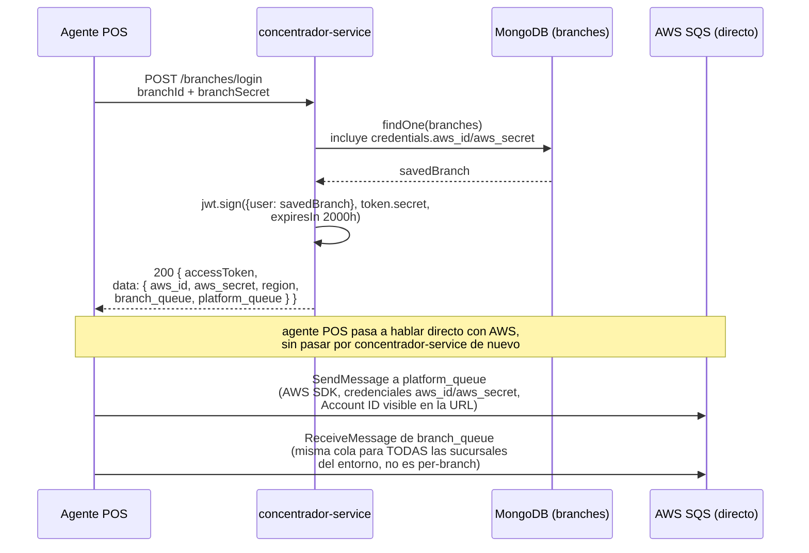
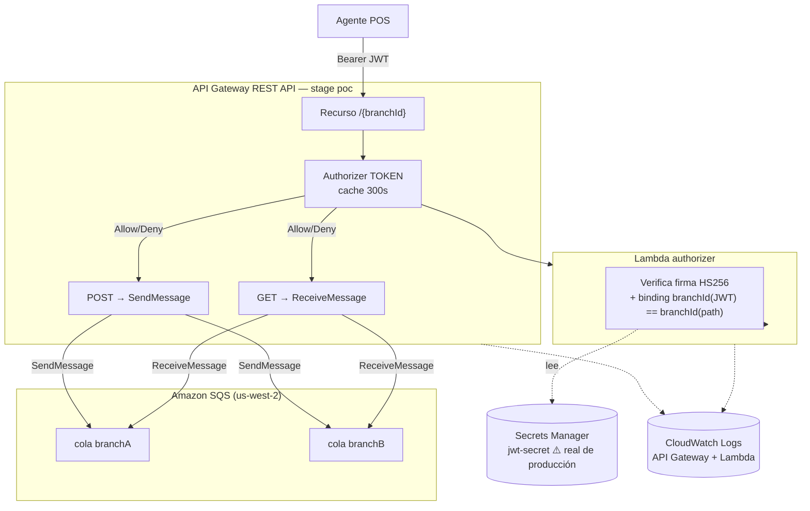
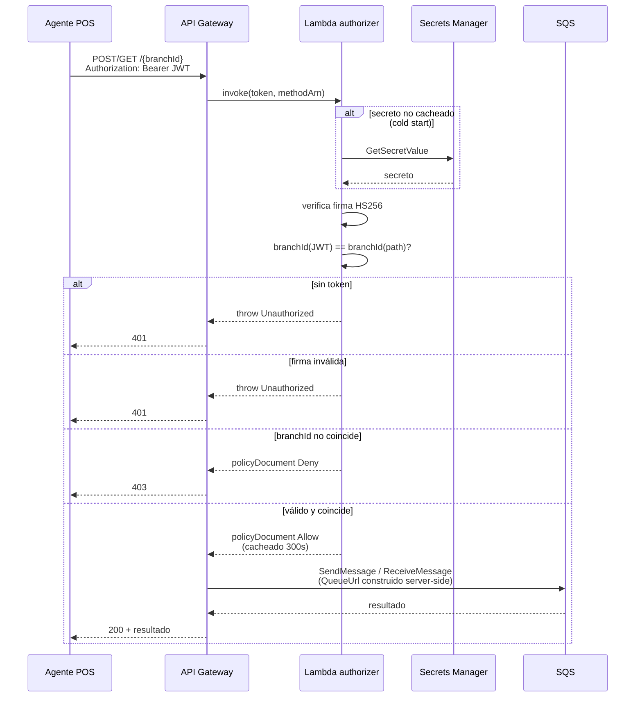

# [SP] Registro de infraestructura real creada en AWS — PoC ARQ-009

**Tipo:** Registro de infraestructura / Auditoría
**Componente:** AWS (SQS, API Gateway, IAM, CloudWatch Logs)
**Prioridad:** Media — sin bloqueo funcional, limpieza pendiente
**Cuenta / Región:** `382381053403` / `us-west-2`
**Etiquetas:** SmartPedidos, AWS, Infraestructura, PoC, SRE
**Referencia:** ticket de origen [20260720_ocultar-account-id-sqs-urls](../20260720_ocultar-account-id-sqs-urls/20260720_ocultar-account-id-sqs-urls.md) (ARQ-009)

---

## Propósito

Durante la construcción y validación del PoC de ARQ-009 (recurso parametrizado `/{branchId}` en API Gateway con integración nativa a SQS) se crearon recursos reales en la cuenta AWS `382381053403`. Este ticket existe exclusivamente para dejar registro auditable de esos recursos y trackear su limpieza — el ticket de origen es de análisis/diseño y no debe cargar con el seguimiento de estado real de infraestructura.

## Recursos creados

| Recurso | ID / ARN | Estado | Notas |
|---|---|---|---|
| Cola SQS FIFO | `poc-arq009-branchA.fifo` | Activa, con backlog de mensajes de prueba | `ContentBasedDeduplication=true` |
| Cola SQS FIFO | `poc-arq009-branchB.fifo` | Activa, con al menos 1 mensaje de prueba | ídem |
| Rol IAM | `poc-arq009-apigw-sqs-role` | Activo | Scopeado a `sqs:SendMessage` sólo sobre las 2 colas de arriba (no `Resource:*`) |
| REST API (API Gateway v1) | `o0o4lrn2hg` ("poc-arq009-hide-account-id") | Activa — **funcional, es la buena** | Recurso `/{branchId}` (id `468mau`), métodos `POST`→`sqs:action/SendMessage` y `GET`→`sqs:action/ReceiveMessage`, ambos con `authorizationType: CUSTOM` (authorizer `1arn20`), stage `poc`, deployment final `bc0tpb` |
| REST API (API Gateway v1) | ~~`5t5c2si3s3`~~ | ✅ Borrado [2026-07-28](20260728_recursos-aws-poc-arq009_events.md#2026-07-28-2) | Duplicado vacío, creado por un doble-`create-rest-api` accidental — dado de baja sin impacto |
| Rol IAM | `apigateway-cloudwatch-logs-poc` | Activo | Creado para diagnosticar un `Internal server error` durante el PoC (logs de ejecución) |
| Configuración de cuenta API Gateway | `cloudwatchRoleArn` (nivel cuenta, región `us-west-2`) | Activa | Apunta al rol anterior — habilita la *capacidad* de logging para cualquier API Gateway de esta cuenta/región, no expone datos por sí sola |
| Log Group CloudWatch | `API-Gateway-Execution-Logs_o0o4lrn2hg/poc` | Activo | `dataTraceEnabled=true` en el stage `poc` — logging de body completo, apropiado para debug de PoC, no para producción |
| Secreto Secrets Manager | `poc-arq009/jwt-secret` | Activo — **contiene el secreto de firma JWT real de producción** | Compartido entre concentrador-service y platforms-service (ver `20260720_credenciales-mongodb-hardcodeadas`). Prioridad máxima de baja |
| Rol IAM | `poc-arq009-authorizer-lambda-role` | Activo | `AWSLambdaBasicExecutionRole` + lectura scopeada del secreto anterior |
| Función Lambda | `poc-arq009-jwt-authorizer` | Activo | Authorizer TOKEN, código en `smartpedidos/repos/ocultar-accountid/authorizer/index.js` |
| Authorizer API Gateway | `1arn20` sobre `o0o4lrn2hg` | Activo | Wireado en `GET`/`POST` de `/{branchId}` — se borra junto con el REST API, no por separado |

Detalle completo (timestamps exactos, ARNs, IDs de deployment) en [`investigation.md`](20260728_recursos-aws-poc-arq009_investigation.md).

## Mapa de transición — cómo es hoy (as-is, verificado contra código fuente)

**Puntos débiles de este flujo, confirmados contra código:**
- `aws_id`/`aws_secret` son el mismo par estático para todas las sucursales (`saveOne`, `branch.js` ~4419) — sin aislamiento real por sucursal pese a guardarse por-sucursal en el schema.
- El Account ID de AWS queda expuesto en cualquier `QueueUrl` que el agente construya o loguee.
- `branch_queue` (`ORDER_CONSUMER.NAME`) es una cola compartida por entorno, no por sucursal.
- Sin mecanismo de revocación de credenciales ni rotación (ver `20260720_credenciales-mongodb-hardcodeadas`).

Mismo diagrama, con más detalle, en el ticket de origen: [20260720_ocultar-account-id-sqs-urls.md](../20260720_ocultar-account-id-sqs-urls/20260720_ocultar-account-id-sqs-urls.md#diagrama-de-flujo-actual-as-is-verificado-contra-código-fuente).

## Mapa de infraestructura

Nombres de recursos únicamente — sin IDs autogenerados de AWS (esos viven en la tabla de arriba y en `investigation.md`, no aportan nada al mapa).

Lo que el llamador nunca ve: el Account ID de AWS, el nombre real de las colas, ni el secreto de firma — todo se resuelve del lado del servidor.

## Mapa de transición (secuencia de una request)

Diagrama de diseño conceptual original (previo a la implementación) en el ticket de origen: [20260720_ocultar-account-id-sqs-urls.md](../20260720_ocultar-account-id-sqs-urls/20260720_ocultar-account-id-sqs-urls.md#diagrama-de-flujo-propuesto).

## Criterios de aceptación

- [ ] Se decidió si el REST API funcional (`o0o4lrn2hg`), las colas y los roles se mantienen como referencia viva mientras se redactan ARQ-001/ARQ-008, o se dan de baja ahora que el mecanismo ya quedó documentado.
- [ ] Se borró el REST API duplicado vacío (`5t5c2si3s3`).
- [ ] Se desactivó `dataTraceEnabled` en el stage `poc` si el API se mantiene vivo (ya no aporta, es exposición innecesaria de body completo en logs).
- [ ] Se ejecutó la baja completa de todos los recursos de esta tabla cuando se decida que el PoC ya cumplió su propósito.

## Sub-tareas

| ID | Descripción | Estado |
|---|---|---|
| INFRA-001 | Borrar REST API duplicado vacío `5t5c2si3s3` | ✅ [2026-07-28](20260728_recursos-aws-poc-arq009_events.md#2026-07-28-2) |
| INFRA-002 | Decidir si se mantiene vivo el PoC como referencia o se da de baja ahora | ⚠️ Pendiente |
| INFRA-003 | Baja completa de recursos (2 colas, 1 REST API, 3 roles IAM, 1 función Lambda) cuando corresponda | ⚠️ Pendiente — requiere confirmación explícita por ser destructivo |
| INFRA-005 | Borrar el secreto `poc-arq009/jwt-secret` con `--force-delete-without-recovery` (no la baja por defecto, que deja el secreto recuperable 7-30 días) — contiene el `token.secret` real de producción, prioridad máxima | ⚠️ Pendiente |
| INFRA-004 | Evaluar si el `cloudwatchRoleArn` de cuenta se mantiene para uso futuro de API Gateway en esta cuenta o se remueve junto con el resto | ⚠️ Pendiente — fuera de alcance de este ticket, a criterio de higiene de cuenta AWS |
