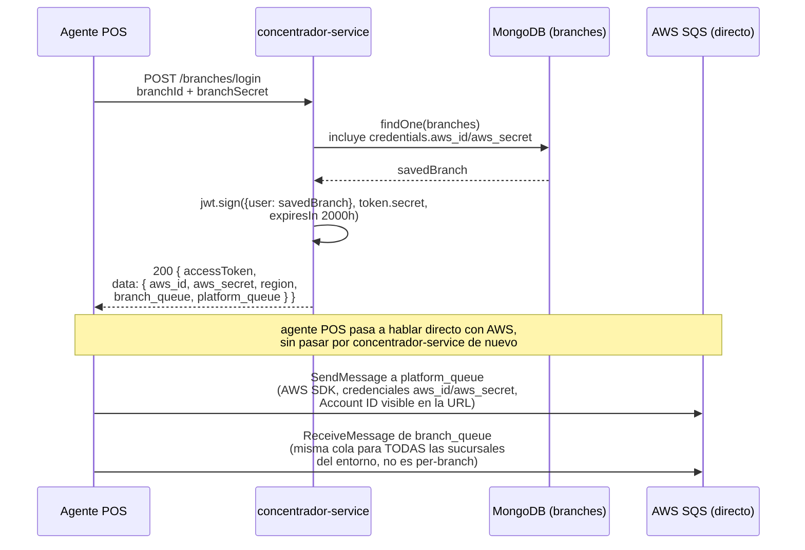
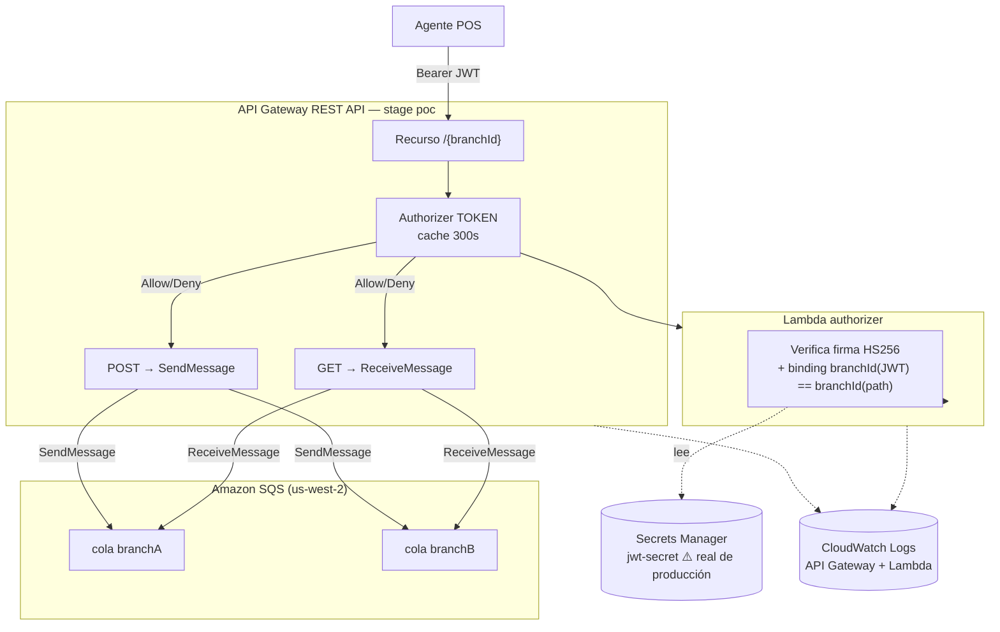
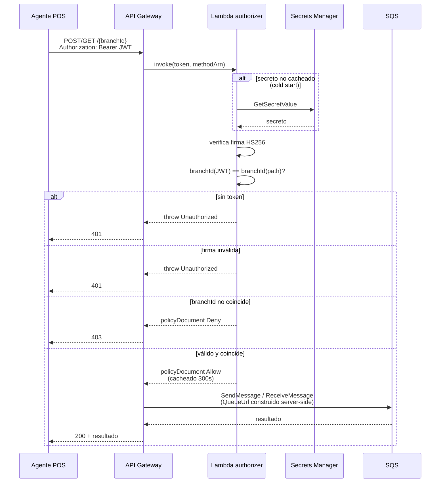

# Infraestructura creada — PoC ARQ-009 / ARQ-002

**Fecha:** 2026-07-28
**Autor:** Dante Paniagua, SRE
**Referencia:** [20260728_recursos-aws-poc-arq009.md](20260728_recursos-aws-poc-arq009.md) (registro de recursos reales), [20260720_ocultar-account-id-sqs-urls](../20260720_ocultar-account-id-sqs-urls/20260720_ocultar-account-id-sqs-urls.md) (ticket de diseño de origen)

## Resumen

**PoC exitoso.** Se construyó y validó de punta a punta, en cuenta AWS `382381053403` / región `us-west-2` (aislada de prod `us-east-1` y staging `us-east-2`), un proxy de API Gateway con autorización JWT que reemplaza el acceso directo del agente POS a SQS. `POST`/`GET` sobre `/{branchId}` funcionando end-to-end contra dos colas de prueba, con `MessageId` verificado en cada caso; los 5 escenarios de autorización probados dieron el resultado esperado (token válido + `branchId` correcto → `200`; token válido + `branchId` de otra sucursal → `403`; sin token → `401`; firma inválida → `401`). El authorizer fue validado contra el secreto de firma real de producción, no uno sintético.

**Alcance:** lo que sigue está validado como mecanismo funcional en el PoC. Los cambios de código en concentrador-service y en el agente POS no fueron implementados todavía (ver "Próximos pasos").

## Mejoras

| # | Mejora | Estado |
|---|---|---|
| 1 | SQS no expuesto a Internet — el cliente sólo conoce el dominio de API Gateway, nunca `sqs.<region>.amazonaws.com` | ✅ Validado en el PoC |
| 2 | Implementación de vault (AWS Secrets Manager) para el secreto de firma JWT, leído dinámicamente por el authorizer | ✅ Implementado en el PoC |
| 3 | Credenciales AWS (`aws_id`/`aws_secret`) removidas del payload de login | 🔄 Validado como viable, no implementado aún — concentrador-service sigue devolviéndolas hoy en producción (ARQ-003, ticket de origen) |
| 4 | Todo el acceso a SQS pasa a ser 100% bearer-token based, sin credencial AWS embebida | 🔄 Validado como viable, no implementado aún — el login ya emite JWT hoy, pero el acceso a SQS posterior sigue usando credenciales AWS estáticas en producción |
| 5 | Sin impacto en performance de concentrador-service | ✅ Validado por diseño — el authorizer nunca llama a concentrador-service; valida la firma localmente contra una copia cacheada del secreto (Secrets Manager + caché de 300s en API Gateway) |

(Account ID de AWS oculto de toda URL vista por el cliente también validado en el PoC — mecanismo base del que se desprenden las mejoras 1 y 4.)

## Mapas

### Cómo es hoy (as-is)

### Infraestructura construida (PoC)

### Transición — secuencia de una request (diseño nuevo, validado)

## Recursos creados (resumen)

Detalle completo, ARNs e IDs en [20260728_recursos-aws-poc-arq009.md](20260728_recursos-aws-poc-arq009.md). En síntesis: 2 colas SQS FIFO, 1 REST API (API Gateway v1, `/{branchId}` con `GET`/`POST`), 1 authorizer TOKEN, 1 función Lambda, 3 roles IAM, 1 secreto en Secrets Manager (contiene el `token.secret` real de producción), configuración de cuenta de API Gateway (logging), CloudWatch Logs. Un REST API duplicado vacío, creado por error durante la sesión, ya fue borrado (INFRA-001).

## Limpieza pendiente

Trackeada en la tabla de sub-tareas de [20260728_recursos-aws-poc-arq009.md](20260728_recursos-aws-poc-arq009.md#sub-tareas): INFRA-002 (decidir si el PoC se mantiene vivo como referencia), INFRA-003 (baja completa de recursos), **INFRA-005 (prioridad máxima — borrar el secreto con `--force-delete-without-recovery`, contiene el `token.secret` real)**, INFRA-004 (higiene de cuenta sobre el rol de logging).

## Próximos pasos para llevar esto a producción

1. **ARQ-003** (ticket de origen): implementar en concentrador-service el gateo por versión de agente para dejar de devolver `aws_id`/`aws_secret`/`platform_queue`/`region`.
2. Migrar el agente POS de SQS directo vía AWS SDK a llamadas HTTPS contra el nuevo proxy.
3. Implementar el authorizer real apuntando al secreto una vez migrado a Secrets Manager en producción (**SEC-114**, ticket `20260720_credenciales-mongodb-hardcodeadas`), no al literal hardcodeado actual.
4. Aprovisionar el *custom domain* `colas.smartpedidos.com` (ARQ-001, ARQ-006).
5. Decidir Opción A vs. A' (ARQ-008) antes de dimensionar el despliegue real.
