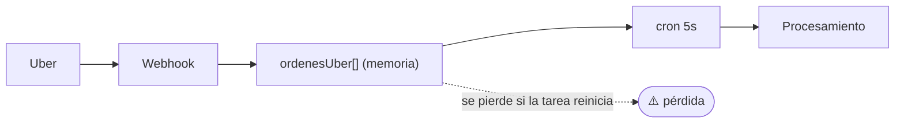
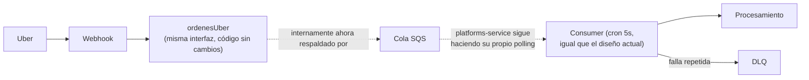
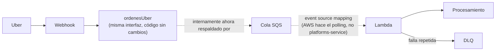
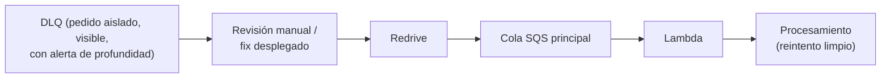
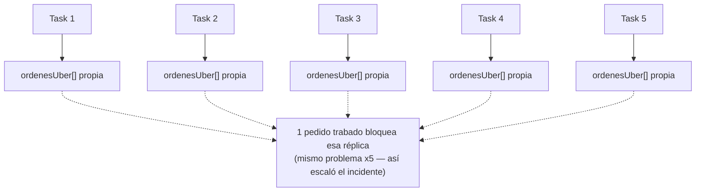
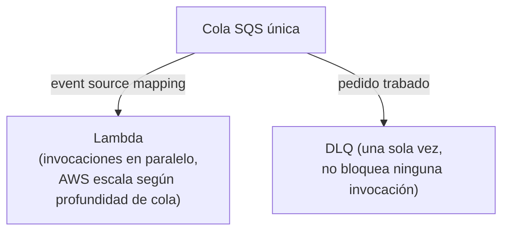

Asunto: Propuesta — cola SQS dedicada para la integración de UberEats (GITIN-1844)

Hola equipo,

Les quiero plantear una propuesta de mejora que surgió del análisis del incidente de UberEats del 12/08 (ticket GITIN-1844), separada del fix puntual que ya está pendiente del lado de desarrollo.

Hoy platforms-service maneja las notificaciones de UberEats con una cola en memoria dentro del propio proceso, que un proceso interno va vaciando cada 5 segundos (`controllers/uberEats.js`, función `processUberQueue`, líneas 25-164; la cola se llena desde `uberNotification`, línea 206). Lo que encontramos en este incidente no es solo el bug puntual que causó el bloqueo, sino que el diseño en sí tiene dos debilidades de fondo: primero, esa cola vive únicamente en memoria, así que un reinicio de tarea la vacía sin dejar rastro — algo relacionado con lo que ya habíamos visto en el incidente de CPU alta del 05/08. Segundo, no hay ningún mecanismo que aísle a un pedido que falla de forma repetida: si uno queda trabado, bloquea a todos los que están detrás en esa misma cola, y como cada réplica del servicio tiene su propia cola en memoria, el mismo problema termina multiplicado por cada una.

La propuesta es reemplazar esa cola en memoria por una cola SQS dedicada para UberEats, con su propia cola de mensajes fallidos (siguiendo el patrón de DLQ que este proyecto ya usa en otras integraciones), consumida mediante un event source mapping de AWS hacia una función Lambda — no un proceso propio de platforms-service haciendo polling. Esto resuelve los dos puntos anteriores de raíz: los pedidos quedarían persistidos fuera del proceso, así que un reinicio de tarea (o la ausencia total de un proceso corriendo) ya no los perdería, y un pedido que falla repetidamente se aislaría automáticamente después de cierta cantidad de intentos, sin bloquear al resto — hoy no tenemos ningún mecanismo equivalente para eso. Un punto importante para minimizar el esfuerzo de implementación del lado del webhook: `ordenesUber` puede mantenerse como la misma interfaz de siempre (`uberNotification` no necesita cambiar cómo la llama) — lo único que cambia es qué hay detrás, un array en memoria hoy, una cola SQS en la propuesta. El código del equipo de UberEats no tendría que tocar esa parte.

Con event source mapping es AWS quien hace el polling por nosotros — no hay cron, ni loop, ni long-polling manual del lado de platforms-service. Lambda se invoca automáticamente cuando llegan mensajes, y AWS escala la cantidad de invocaciones en paralelo según el volumen en cola. Es un cambio más de fondo que "agregar SQS nomás": implica una nueva unidad de despliegue (Lambda, con su propio pipeline de despliegue y rol IAM) separada de los servicios ECS actuales, y manejo propio de la conexión a MongoDB Atlas desde ese entorno. A cambio, platforms-service no necesitaría ningún código de consumo, y el aislamiento por mensaje viene dado nativamente por el event source mapping, sin depender de la lógica de try/catch actual del lado de la aplicación.

Para que quede claro de un vistazo:

Mapa 1 — Flujo actual:

Mapa 2 — Flujo propuesto (CRON 5s) — Etapa 1, menor esfuerzo:

La diferencia con Mapa 1 es solo la persistencia (SQS en vez de memoria) y el aislamiento por DLQ — seguimos atados a un scheduler propio, con el mismo techo de latencia que tenemos hoy. Es la opción de menor esfuerzo, y ya resuelve los dos puntos más urgentes (pérdida de pedidos por reinicio, bloqueo total por un pedido trabado); no resuelve el punto de fondo (scheduler propio, sin auto-scaling) que sí resuelve la Mapa 3.

Mapa 3 — Flujo propuesto (EventSource):

Pensándolo en dos pasos en vez de todo o nada: Mapa 1 → Mapa 2 ya es una mejora de bajo esfuerzo por sí sola — reutiliza el mismo modelo de despliegue de hoy (ECS, un consumer con cron) y resuelve durabilidad + aislamiento por DLQ sin agregar Lambda ni ningún componente nuevo. Mapa 2 → Mapa 3 es el paso de mayor esfuerzo (nueva unidad de despliegue, IAM, conexión a Mongo desde Lambda) pero es el que saca el scheduler del medio y agrega auto-scaling real. Se puede plantear como una migración en dos etapas en vez de una sola decisión grande: arrancar por Mapa 2 ahora, evaluar Mapa 3 como evolución posterior.

Mapa 4 — Qué pasa con lo que cae en la DLQ (no se pierde, a diferencia de hoy):

Mapa 5 — Cómo cambia esto entre réplicas (hoy son 5 tareas de platforms-service corriendo en paralelo):

Hoy — cada réplica tiene su propia cola en memoria, aislada:

Propuesto — ya no hay réplicas fijas consumiendo; Lambda escala automáticamente sobre una única cola:

A diferencia del comportamiento actual — donde un pedido trabado se reintenta a ciegas cada 5 segundos hasta perderse silenciosamente a las 24hs —, un mensaje en la DLQ queda ahí de forma estable hasta que alguien lo mire. Una vez identificada la causa (o corregido el bug que la originó), se puede redirigir manualmente de vuelta a la cola principal para un reintento limpio, sin perder el pedido original.

Quiero ser claro en que esto es una propuesta de mediano plazo, no algo urgente ni un reemplazo del fix que ya está pendiente para el bug puntual de este incidente — ese sigue siendo lo prioritario. Lo dejo planteado como una mejora de diseño para evaluar con desarrollo, para que no se pierda de vista una vez cerrado el incidente.

Todo el detalle técnico está en el ticket.

Saludos,
Dante
